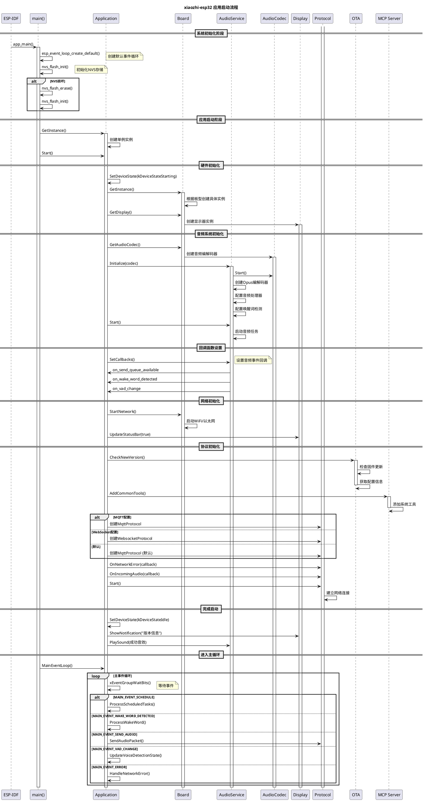

# 应用启动流程时序图

## 🚀 Application Startup Sequence

这个时序图展示了xiaozhi-esp32应用从启动到就绪的完整过程。

## 🔍 关键阶段说明

### 1. 系统初始化阶段 (0-100ms)
- ESP-IDF调用app_main()
- 创建事件循环和初始化NVS
- 包含错误恢复机制

### 2. 应用启动阶段 (100-500ms)
- 创建Application单例
- 设置设备状态为"启动中"
- 初始化硬件抽象层

### 3. 硬件初始化 (500-1000ms)
- 根据开发板类型创建具体Board实例
- 初始化显示器和音频编解码器
- 配置GPIO、I2C、SPI等外设

### 4. 音频系统初始化 (1000-1500ms)
- 创建AudioService和相关组件
- 启动音频采集和播放任务
- 配置唤醒词检测和语音处理

### 5. 网络和协议初始化 (1500-3000ms)
- 启动网络连接（WiFi/以太网）
- 检查OTA更新
- 根据配置选择通信协议
- 建立与服务器的连接

### 6. 完成启动 (3000ms+)
- 设置设备状态为"空闲"
- 播放成功提示音
- 进入主事件循环

## ⚡ 性能关键点

### 并行初始化
- 硬件初始化与网络连接并行进行
- 音频系统独立初始化，不阻塞主流程

### 错误处理
- NVS损坏自动恢复
- 网络连接失败重试机制
- 音频设备初始化失败降级处理

### 资源管理
- 使用智能指针自动管理内存
- RAII模式确保资源正确释放
- 事件驱动避免轮询浪费

---

**相关文档**:
- [Application类详细分析](../02-main-core/02-application-class.md)
- [音频服务启动流程](./02-audio-service-startup.md)
- [网络协议连接流程](./03-protocol-connection.md)
