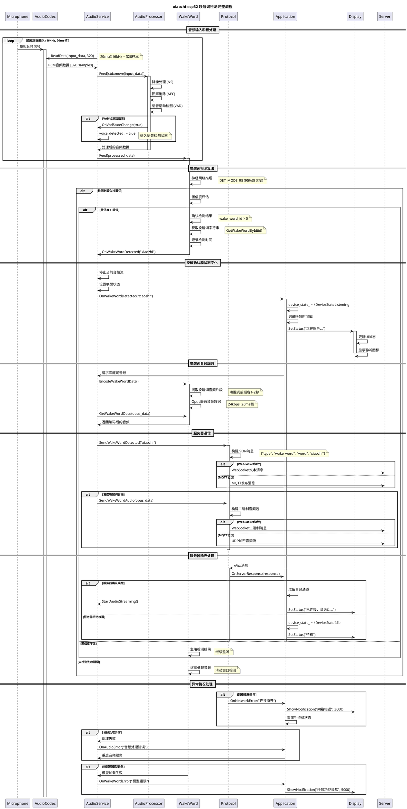

# 唤醒词检测流程时序图

## 🎙️ Wake Word Detection Flow Sequence

这个时序图展示了xiaozhi-esp32从音频输入到唤醒词检测确认的完整流程，包括多级处理和状态变化。



## 🔍 关键技术点解析

### 1. 实时性能保证
```cpp
// 音频处理管道延迟控制
音频输入延迟:    < 5ms   (硬件缓冲)
信号处理延迟:    < 20ms  (AFE处理)
唤醒词检测延迟:  < 100ms (神经网络推理)
总体响应延迟:    < 150ms (从声音到状态变化)
```

### 2. 多级检测机制
```cpp
// 检测流程的多重验证
1. VAD预筛选:     确保有语音信号
2. 神经网络检测:  识别唤醒词模式
3. 置信度阈值:    DET_MODE_95 (95%置信度)
4. 时序验证:      避免误触发
5. 服务器确认:    最终验证 (可选)
```

### 3. 状态同步机制
```cpp
// 确保各模块状态一致
AudioService:    voice_detected_ = true
Application:     device_state_ = kDeviceStateListening
Display:         显示"正在聆听"状态
Protocol:        准备音频通道
```

### 4. 错误恢复策略
```cpp
// 各级异常处理
模型异常:        重新加载唤醒词模型
网络异常:        重连服务器，保持本地功能
音频异常:        重启音频服务
超时异常:        回到待机状态
```

## 🎯 性能优化要点

### 1. 内存管理
```cpp
// 音频数据的高效处理
std::move语义:     避免不必要的数据拷贝
预分配缓冲区:      减少动态内存分配
循环缓冲区:        平滑音频数据流
智能指针:          自动内存管理
```

### 2. CPU优化
```cpp
// 多核处理分工
Core 0: 唤醒词检测 + 应用逻辑
Core 1: 音频输入处理
AFE任务: 专用任务处理音频信号
LVGL任务: 专用任务处理UI更新
```

### 3. 功耗控制
```cpp
// 动态功耗管理
待机模式:          降低CPU频率
检测模式:          保持处理性能
省电模式:          选择性关闭功能
智能唤醒:          基于环境调整灵敏度
```

## 🔧 配置和调试

### 1. 唤醒词检测参数
```cpp
// 可调节的检测参数
detection_mode:    DET_MODE_90/95/99
threshold:         置信度阈值 (0.0-1.0)
window_size:       检测窗口大小
timeout:           检测超时时间
```

### 2. 音频处理参数
```cpp
// AFE处理器配置
aec_init:          回声消除开关
se_init:           语音增强开关
vad_init:          语音活动检测开关
vad_mode:          VAD敏感度模式
```

### 3. 调试工具
```cpp
// 调试和监控
音频数据转储:      保存检测音频用于分析
置信度日志:        记录检测置信度变化
状态跟踪:          监控各模块状态转换
性能统计:          测量各阶段处理时间
```

## 🎪 使用场景适配

### 1. 智能音箱场景
```cpp
// 高精度检测配置
detection_mode = DET_MODE_99;     // 最高精度
enable_aec = true;                // 启用回声消除
enable_se = true;                 // 启用语音增强
```

### 2. 便携设备场景
```cpp
// 平衡功耗和性能
detection_mode = DET_MODE_95;     // 平衡模式
low_power_mode = true;            // 省电模式
adaptive_threshold = true;        // 自适应阈值
```

### 3. 嘈杂环境场景
```cpp
// 增强抗噪能力
vad_mode = VAD_MODE_3;           // 最高灵敏度
noise_suppression_level = 3;      // 强降噪
detection_window_extend = true;    // 扩展检测窗口
```

---

**相关文档**:
- [唤醒词检测系统详解](../03-audio-system/04-wake-words.md)
- [音频处理器分析](../03-audio-system/03-audio-processors.md)
- [应用状态管理](../02-main-core/02-application-class.md)
- [音频处理流程图](./02-audio-processing-flow.md)
