# 网络连接建立流程时序图

## 🌐 Network Connection Flow Sequence

这个时序图展示了xiaozhi-esp32网络连接建立的完整流程，包括WiFi连接、MQTT/WebSocket协议建立和故障切换机制。

```plantuml
@startuml Network_Connection_Flow
title xiaozhi-esp32 网络连接建立完整流程

participant "Application" as APP
participant "Board" as BOARD
participant "WifiStation" as WIFI
participant "NetworkInterface" as NET
participant "Protocol" as PROTO
participant "MqttProtocol" as MQTT
participant "WebsocketProtocol" as WS
participant "Server" as SERVER
participant "Display" as DISPLAY

== 系统启动和网络初始化 ==

APP -> BOARD: StartNetwork()
activate BOARD

BOARD -> BOARD: 检查板卡类型
note right: WifiBoard / Ml307Board / DualNetworkBoard

alt WiFi板卡
    BOARD -> WIFI: GetInstance()
    activate WIFI

    BOARD -> WIFI: 检查WiFi配置
    WIFI -> WIFI: 读取NVS存储的凭据

    alt 首次启动 (无WiFi配置)
        WIFI -> WIFI: wifi_config_mode_ = true
        WIFI -> NET: StartConfigPortal()
        activate NET

        NET -> NET: 启动AP模式
        note right: SSID: "XiaoZhi-Setup-XXXX"

        NET -> DISPLAY: ShowWifiConfigMode()
        activate DISPLAY
        DISPLAY -> DISPLAY: 显示配置二维码
        DISPLAY -> DISPLAY: 显示配置说明
        deactivate DISPLAY

        NET -> NET: 启动Web配置服务器
        note right: HTTP Server on 192.168.4.1

        loop 等待用户配置
            NET -> NET: 处理配置请求
            alt 收到WiFi凭据
                NET -> WIFI: SetCredentials(ssid, password)
                WIFI -> WIFI: 保存到NVS存储
                NET -> NET: 重启到STA模式
                break
            end
        end

        deactivate NET
    end

    == WiFi STA连接建立 ==

    WIFI -> NET: Connect(ssid, password)
    activate NET

    NET -> NET: 配置WiFi STA模式
    NET -> NET: esp_wifi_set_config(WIFI_IF_STA, &wifi_config)
    NET -> NET: esp_wifi_start()
    NET -> NET: esp_wifi_connect()

    loop 连接重试 (最多10次)
        NET -> NET: 等待连接事件

        alt 连接成功
            NET -> NET: 获取IP地址 (DHCP)
            NET -> WIFI: OnConnected(ip_address)
            WIFI -> APP: OnNetworkConnected()
            break

        else 连接失败
            NET -> NET: 重试连接
            note right: 指数退避策略

        else 超时失败
            NET -> WIFI: OnConnectFailed("连接超时")
            WIFI -> APP: OnNetworkError("WiFi连接失败")
            APP -> DISPLAY: ShowNotification("网络连接失败", 5000)
            break
        end
    end

    deactivate NET
    deactivate WIFI

else 4G板卡 (ML307)
    BOARD -> BOARD: 初始化ML307模块
    note right: UART通信 + AT指令

else 双网络板卡
    BOARD -> BOARD: LoadNetworkTypeFromSettings()
    alt 网络类型 = WiFi
        BOARD -> BOARD: 创建WifiBoard实例
    else 网络类型 = 4G
        BOARD -> BOARD: 创建Ml307Board实例
    end
end

deactivate BOARD

== 应用层协议连接 ==

APP -> APP: InitializeProtocol()
APP -> APP: 读取协议配置

alt 协议类型 = WebSocket
    APP -> WS: 创建WebsocketProtocol实例
    activate WS

    APP -> WS: Start()
    WS -> WS: 读取WebSocket配置
    note right: URL, Token, Version

    WS -> WS: OpenAudioChannel()
    WS -> NET: CreateWebSocket(1)
    NET -> WS: 返回WebSocket客户端

    WS -> WS: 设置HTTP头
    note right: Authorization: Bearer <token>
    note right: Protocol-Version: 1
    note right: Device-Id: <mac_address>
    note right: Client-Id: <uuid>

    WS -> SERVER: WebSocket握手请求
    activate SERVER

    SERVER -> SERVER: 验证认证信息
    SERVER -> SERVER: 检查协议版本

    alt 握手成功
        SERVER -> WS: WebSocket握手响应 (101 Switching Protocols)
        WS -> WS: 连接建立成功

        == WebSocket初始化协议 ==

        WS -> SERVER: 发送initialize消息
        note right: {"jsonrpc": "2.0", "method": "initialize", "id": 1}

        SERVER -> WS: 返回初始化响应
        note right: {"id": 1, "result": {"protocolVersion": "2024-11-05"}}

        WS -> WS: ParseServerHello(response)
        WS -> WS: 设置服务器参数
        note right: server_sample_rate_, server_frame_duration_

        WS -> APP: OnAudioChannelOpened()

    else 握手失败
        SERVER -> WS: HTTP错误响应 (401/403)
        WS -> APP: OnNetworkError("WebSocket握手失败")
    end

    deactivate SERVER
    deactivate WS

else 协议类型 = MQTT
    APP -> MQTT: 创建MqttProtocol实例
    activate MQTT

    APP -> MQTT: Start()
    MQTT -> MQTT: StartMqttClient()
    MQTT -> MQTT: 读取MQTT配置
    note right: endpoint, client_id, username, password

    MQTT -> NET: CreateMqtt(0)
    NET -> MQTT: 返回MQTT客户端

    MQTT -> SERVER: MQTT CONNECT
    activate SERVER

    SERVER -> SERVER: 验证用户凭据

    alt 连接成功
        SERVER -> MQTT: MQTT CONNACK
        MQTT -> MQTT: 订阅主题
        note right: subscribe_topic_

        MQTT -> SERVER: MQTT SUBSCRIBE
        SERVER -> MQTT: MQTT SUBACK

        == MQTT+UDP音频通道建立 ==

        loop 等待服务器Hello消息
            SERVER -> MQTT: 服务器Hello消息
            note right: 包含UDP服务器地址和端口

            MQTT -> MQTT: ParseServerHello()
            MQTT -> MQTT: 提取UDP连接信息
            break
        end

        MQTT -> NET: CreateUdp(1)
        NET -> MQTT: 返回UDP客户端

        MQTT -> SERVER: UDP连接建立
        note right: 用于实时音频流传输

        MQTT -> MQTT: 初始化AES加密
        note right: 音频数据加密传输

        MQTT -> APP: OnAudioChannelOpened()

    else 连接失败
        SERVER -> MQTT: MQTT CONNACK (错误码)
        MQTT -> APP: OnNetworkError("MQTT连接失败")
    end

    deactivate SERVER
    deactivate MQTT
end

== 连接状态监控和故障处理 ==

loop 运行时监控
    alt 网络连接断开
        NET -> APP: OnNetworkDisconnected()
        APP -> DISPLAY: ShowNotification("网络连接断开", 3000)
        APP -> APP: 尝试重连网络

    else 协议连接断开
        PROTO -> APP: OnNetworkError("协议连接断开")
        APP -> APP: 尝试重连协议

        loop 重连重试 (最多3次)
            APP -> PROTO: Start()
            alt 重连成功
                PROTO -> APP: OnAudioChannelOpened()
                APP -> DISPLAY: ShowNotification("连接已恢复", 2000)
                break
            else 重连失败
                APP -> APP: 增加重试计数
                alt 达到最大重试次数
                    APP -> DISPLAY: ShowNotification("连接失败，请检查网络", 5000)
                    break
                end
            end
        end
    end

    alt 双网络板卡自动切换
        BOARD -> BOARD: 检测当前网络质量
        alt 网络质量差
            BOARD -> BOARD: SwitchNetworkType()
            BOARD -> DISPLAY: ShowMessage("切换网络中...")
            BOARD -> BOARD: InitializeCurrentBoard()
            BOARD -> BOARD: StartNetwork()
            note right: 自动在WiFi和4G间切换
        end
    end
end

== 协议数据传输测试 ==

APP -> PROTO: 发送测试消息
activate PROTO

alt WebSocket协议
    PROTO -> SERVER: WebSocket消息 (JSON/Binary)
    SERVER -> PROTO: 响应消息

else MQTT协议
    PROTO -> SERVER: MQTT发布消息
    SERVER -> PROTO: UDP音频数据包
end

PROTO -> APP: 数据传输正常
deactivate PROTO

APP -> DISPLAY: UpdateStatusBar()
DISPLAY -> DISPLAY: 显示网络连接状态图标

@enduml
```



## 🔍 关键技术点解析

### 1. WiFi连接状态机
```cpp
enum WifiState {
    WIFI_STATE_DISCONNECTED,    // 未连接
    WIFI_STATE_CONNECTING,      // 连接中
    WIFI_STATE_CONNECTED,       // 已连接
    WIFI_STATE_CONFIG_MODE,     // 配置模式
    WIFI_STATE_RECONNECTING     // 重连中
};

// WiFi事件处理
void WifiEventHandler(wifi_event_t event) {
    switch (event) {
        case WIFI_EVENT_STA_START:
            esp_wifi_connect();
            break;
        case WIFI_EVENT_STA_CONNECTED:
            SetWifiState(WIFI_STATE_CONNECTED);
            break;
        case WIFI_EVENT_STA_DISCONNECTED:
            SetWifiState(WIFI_STATE_DISCONNECTED);
            StartReconnection();
            break;
    }
}
```

### 2. 协议切换策略
```cpp
class ProtocolManager {
    std::vector<std::string> protocol_priorities_ = {"websocket", "mqtt"};

    bool ConnectWithFallback() {
        for (const auto& protocol_type : protocol_priorities_) {
            auto protocol = CreateProtocol(protocol_type);
            if (protocol && protocol->Start()) {
                current_protocol_ = std::move(protocol);
                return true;
            }
        }
        return false;
    }
};
```

### 3. 网络质量监控
```cpp
class NetworkQualityMonitor {
    struct QualityMetrics {
        int signal_strength;        // 信号强度 (dBm)
        int packet_loss_rate;       // 丢包率 (%)
        int latency_ms;            // 延迟 (ms)
        bool is_stable;            // 连接稳定性
    };

    void MonitorQuality() {
        QualityMetrics metrics = GetCurrentMetrics();

        if (metrics.signal_strength < -70 ||
            metrics.packet_loss_rate > 10 ||
            metrics.latency_ms > 1000) {
            TriggerNetworkSwitch();
        }
    }
};
```

### 4. 重连机制优化
```cpp
class ReconnectionManager {
    int retry_count_ = 0;
    std::chrono::seconds base_delay_ = std::chrono::seconds(1);

    void ScheduleReconnection() {
        // 指数退避策略
        auto delay = base_delay_ * (1 << std::min(retry_count_, 6));  // 最大64秒

        std::this_thread::sleep_for(delay);

        if (AttemptReconnection()) {
            retry_count_ = 0;  // 重置重试计数
        } else {
            retry_count_++;
        }
    }
};
```

## 🚀 性能优化要点

### 1. 连接时间优化
```cpp
// WiFi连接加速
wifi_config.fast_scan = true;           // 快速扫描
wifi_config.scan_method = WIFI_FAST_SCAN; // 首次匹配即连接

// DNS优化
esp_netif_dns_info_t dns_info;
inet_aton("8.8.8.8", &dns_info.ip.u_addr.ip4);  // 使用快速DNS
esp_netif_set_dns_info(netif, ESP_NETIF_DNS_MAIN, &dns_info);
```

### 2. 协议握手优化
```cpp
// WebSocket握手优化
websocket_->SetHeader("Connection", "Upgrade");
websocket_->SetHeader("Upgrade", "websocket");
websocket_->SetKeepAlive(true);

// MQTT连接优化
mqtt_->SetKeepAlive(240);               // 240秒心跳
mqtt_->SetCleanSession(true);           // 清理会话
mqtt_->SetConnectTimeout(5000);         // 5秒连接超时
```

### 3. 内存使用优化
```cpp
// 连接池复用
class ConnectionPool {
    std::queue<std::unique_ptr<NetworkConnection>> idle_connections_;

    std::unique_ptr<NetworkConnection> GetConnection() {
        if (!idle_connections_.empty()) {
            auto conn = std::move(idle_connections_.front());
            idle_connections_.pop();
            return conn;
        }
        return std::make_unique<NetworkConnection>();
    }
};
```

## 🔧 故障诊断和调试

### 1. 网络连接诊断
```cpp
void DiagnoseNetworkIssues() {
    // WiFi信号强度检查
    wifi_ap_record_t ap_info;
    if (esp_wifi_sta_get_ap_info(&ap_info) == ESP_OK) {
        ESP_LOGI(TAG, "WiFi RSSI: %d dBm", ap_info.rssi);
        if (ap_info.rssi < -70) {
            ESP_LOGW(TAG, "Weak WiFi signal detected");
        }
    }

    // DNS解析测试
    struct addrinfo* result;
    int dns_result = getaddrinfo("www.google.com", NULL, NULL, &result);
    if (dns_result != 0) {
        ESP_LOGE(TAG, "DNS resolution failed: %d", dns_result);
    } else {
        ESP_LOGI(TAG, "DNS resolution successful");
        freeaddrinfo(result);
    }

    // 网络延迟测试
    auto start = std::chrono::steady_clock::now();
    // 执行ping测试...
    auto end = std::chrono::steady_clock::now();
    auto latency = std::chrono::duration_cast<std::chrono::milliseconds>(end - start);
    ESP_LOGI(TAG, "Network latency: %lld ms", latency.count());
}
```

### 2. 协议连接诊断
```cpp
void DiagnoseProtocolIssues() {
    // WebSocket状态检查
    if (websocket_ && websocket_->IsConnected()) {
        ESP_LOGI(TAG, "WebSocket connected");
    } else {
        ESP_LOGE(TAG, "WebSocket disconnected");
    }

    // MQTT状态检查
    if (mqtt_ && mqtt_->IsConnected()) {
        ESP_LOGI(TAG, "MQTT connected");
    } else {
        ESP_LOGE(TAG, "MQTT disconnected");
    }

    // 协议延迟测试
    auto start = std::chrono::steady_clock::now();
    SendPingMessage();
    // 等待Pong响应...
    auto end = std::chrono::steady_clock::now();
    auto protocol_latency = std::chrono::duration_cast<std::chrono::milliseconds>(end - start);
    ESP_LOGI(TAG, "Protocol latency: %lld ms", protocol_latency.count());
}
```

### 3. 配置验证工具
```cpp
void ValidateNetworkConfiguration() {
    // WiFi配置验证
    Settings wifi_settings("wifi", false);
    std::string ssid = wifi_settings.GetString("ssid");
    if (ssid.empty()) {
        ESP_LOGE(TAG, "WiFi SSID not configured");
    }

    // 协议配置验证
    Settings protocol_settings("protocol", false);
    std::string protocol_type = protocol_settings.GetString("type");

    if (protocol_type == "websocket") {
        Settings ws_settings("websocket", false);
        std::string url = ws_settings.GetString("url");
        if (url.empty()) {
            ESP_LOGE(TAG, "WebSocket URL not configured");
        }
    } else if (protocol_type == "mqtt") {
        Settings mqtt_settings("mqtt", false);
        std::string endpoint = mqtt_settings.GetString("endpoint");
        if (endpoint.empty()) {
            ESP_LOGE(TAG, "MQTT endpoint not configured");
        }
    }
}
```

---

**相关文档**:
- [通信协议详解](../06-protocols/01-protocol-overview.md)
- [硬件抽象层](../05-board-abstraction/01-board-base.md)
- [设置管理系统](../07-utilities/04-settings-system.md)
- [应用启动流程](./01-application-startup.md)
