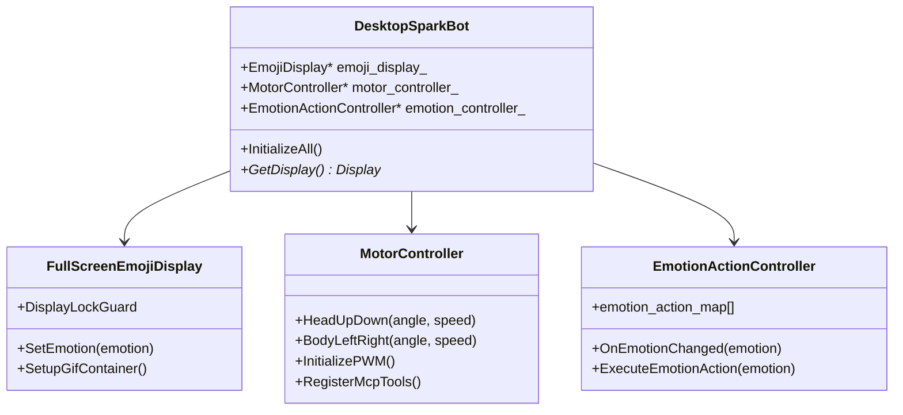

# ESP-SparkBot 桌面小机器人完整实现方案

## 📋 项目概述

基于现有esp-sparkbot配置，扩展实现一个桌面小机器人，具备：
1. **全屏表情显示** - 类似esp-hi的放大版表情系统
2. **头部上下转动** - 通过减速电机控制
3. **身体左右转动** - 通过减速电机控制
4. **情绪驱动动作** - 根据情绪执行相应的转动动作

## 🎯 硬件配置

### 现有ESP-SparkBot硬件
```cpp
// 现有配置保持不变
#define DISPLAY_WIDTH   240
#define DISPLAY_HEIGHT  240
#define AUDIO_CODEC_PA_PIN       GPIO_NUM_46
#define AUDIO_CODEC_I2C_SDA_PIN  GPIO_NUM_4
#define AUDIO_CODEC_I2C_SCL_PIN  GPIO_NUM_5
```

### 新增减速电机配置
```cpp
// 头部上下转动电机
#define HEAD_MOTOR_PWM_PIN     GPIO_NUM_1   // 头部电机PWM
#define HEAD_MOTOR_DIR1_PIN    GPIO_NUM_2   // 头部电机方向1
#define HEAD_MOTOR_DIR2_PIN    GPIO_NUM_3   // 头部电机方向2

// 身体左右转动电机
#define BODY_MOTOR_PWM_PIN     GPIO_NUM_14  // 身体电机PWM
#define BODY_MOTOR_DIR1_PIN    GPIO_NUM_19  // 身体电机方向1
#define BODY_MOTOR_DIR2_PIN    GPIO_NUM_20  // 身体电机方向2

// 电机控制参数
#define MOTOR_PWM_FREQUENCY    1000         // PWM频率 1KHz
#define MOTOR_PWM_RESOLUTION   LEDC_TIMER_10_BIT  // 10位分辨率 (0-1023)
#define MOTOR_MAX_SPEED        800          // 最大速度 (0-1023)
#define MOTOR_MIN_SPEED        200          // 最小速度
```

## 🏗️ 软件架构设计

### 类结构图


## 📁 文件结构

```
main/boards/desktop-sparkbot/
├── desktop_sparkbot_board.cc       # 主板类实现
├── desktop_sparkbot_board.h        # 主板类头文件
├── config.h                        # 硬件配置
├── config.json                     # 板卡配置
├── fullscreen_emoji_display.cc     # 全屏表情显示
├── fullscreen_emoji_display.h      # 表情显示头文件
├── motor_controller.cc             # 电机控制器
├── motor_controller.h              # 电机控制器头文件
├── emotion_action_controller.cc    # 情绪动作控制器
├── emotion_action_controller.h     # 情绪动作控制器头文件
└── README.md                       # 说明文档
```

## 💻 详细实现

### 1. 硬件配置文件

#### `main/boards/desktop-sparkbot/config.h`
```cpp
#ifndef _DESKTOP_SPARKBOT_CONFIG_H_
#define _DESKTOP_SPARKBOT_CONFIG_H_

#include <driver/gpio.h>
#include <driver/uart.h>
#include <driver/ledc.h>

// 继承ESP-SparkBot的所有现有配置
#include "../esp-sparkbot/config.h"

// 新增减速电机配置
// 头部上下转动电机
#define HEAD_MOTOR_PWM_PIN     GPIO_NUM_1   // 头部电机PWM
#define HEAD_MOTOR_DIR1_PIN    GPIO_NUM_2   // 头部电机方向1
#define HEAD_MOTOR_DIR2_PIN    GPIO_NUM_3   // 头部电机方向2

// 身体左右转动电机
#define BODY_MOTOR_PWM_PIN     GPIO_NUM_14  // 身体电机PWM
#define BODY_MOTOR_DIR1_PIN    GPIO_NUM_19  // 身体电机方向1
#define BODY_MOTOR_DIR2_PIN    GPIO_NUM_20  // 身体电机方向2

// 电机控制参数
#define MOTOR_PWM_FREQUENCY    1000         // PWM频率 1KHz
#define MOTOR_PWM_RESOLUTION   LEDC_TIMER_10_BIT  // 10位分辨率 (0-1023)
#define MOTOR_MAX_SPEED        800          // 最大速度 (0-1023)
#define MOTOR_MIN_SPEED        200          // 最小速度
#define MOTOR_STOP_SPEED       0            // 停止速度

// 电机角度限制
#define HEAD_MIN_ANGLE         -45          // 头部最小角度（向下）
#define HEAD_MAX_ANGLE         45           // 头部最大角度（向上）
#define BODY_MIN_ANGLE         -90          // 身体最小角度（向左）
#define BODY_MAX_ANGLE         90           // 身体最大角度（向右）

// 电机运动参数
#define MOTOR_DEFAULT_SPEED    400          // 默认运动速度
#define MOTOR_SMOOTH_SPEED     200          // 平滑运动速度
#define MOTOR_FAST_SPEED       600          // 快速运动速度

// LEDC通道分配
#define HEAD_MOTOR_PWM_CHANNEL LEDC_CHANNEL_0
#define BODY_MOTOR_PWM_CHANNEL LEDC_CHANNEL_1
#define MOTOR_PWM_TIMER        LEDC_TIMER_1

#endif // _DESKTOP_SPARKBOT_CONFIG_H_
```

### 2. 减速电机控制器

#### `main/boards/desktop-sparkbot/motor_controller.h`
```cpp
#pragma once

#include "config.h"
#include "mcp_server.h"
#include <driver/ledc.h>
#include <driver/gpio.h>
#include <freertos/FreeRTOS.h>
#include <freertos/task.h>
#include <freertos/queue.h>
#include <esp_log.h>

class MotorController {
public:
    MotorController();
    ~MotorController();

    // 初始化电机
    void Initialize();

    // 头部控制
    void HeadUpDown(int angle, int speed = MOTOR_DEFAULT_SPEED);
    void HeadUp(int steps = 1, int speed = MOTOR_DEFAULT_SPEED);
    void HeadDown(int steps = 1, int speed = MOTOR_DEFAULT_SPEED);
    void HeadCenter(int speed = MOTOR_DEFAULT_SPEED);
    void HeadNod(int times = 1, int speed = MOTOR_DEFAULT_SPEED);

    // 身体控制
    void BodyLeftRight(int angle, int speed = MOTOR_DEFAULT_SPEED);
    void BodyTurnLeft(int steps = 1, int speed = MOTOR_DEFAULT_SPEED);
    void BodyTurnRight(int steps = 1, int speed = MOTOR_DEFAULT_SPEED);
    void BodyCenter(int speed = MOTOR_DEFAULT_SPEED);
    void BodyShake(int times = 1, int speed = MOTOR_DEFAULT_SPEED);

    // 复合动作
    void ExpressHappy(int intensity = 2);
    void ExpressSad(int intensity = 1);
    void ExpressAngry(int intensity = 3);
    void ExpressSurprised(int intensity = 2);
    void ExpressThinking(int intensity = 1);
    void ExpressNeutral();

    // 停止所有电机
    void StopAll();

    // 获取当前角度
    int GetHeadAngle() const { return current_head_angle_; }
    int GetBodyAngle() const { return current_body_angle_; }

    // 注册MCP工具
    void RegisterMcpTools();

private:
    // 电机控制状态
    int current_head_angle_;
    int current_body_angle_;
    bool is_moving_;

    // 任务和队列
    TaskHandle_t motor_task_handle_;
    QueueHandle_t motor_queue_;

    // 电机命令结构
    struct MotorCommand {
        enum Type {
            HEAD_MOVE,
            BODY_MOVE,
            STOP_ALL,
            COMPLEX_ACTION
        } type;

        int target_angle;
        int speed;
        int steps;
        int times;
    };

    // 私有方法
    void InitializePWM();
    void InitializeGPIO();
    void SetMotorPWM(ledc_channel_t channel, int speed);
    void SetMotorDirection(gpio_num_t dir1_pin, gpio_num_t dir2_pin, bool forward);
    void MoveToAngle(bool is_head, int target_angle, int speed);
    void ExecuteMotorCommand(const MotorCommand& cmd);

    // 电机任务
    static void MotorTask(void* arg);

    // 队列操作
    void QueueCommand(MotorCommand::Type type, int angle = 0, int speed = MOTOR_DEFAULT_SPEED,
                     int steps = 1, int times = 1);
};
```

#### `main/boards/desktop-sparkbot/motor_controller.cc`
```cpp
#include "motor_controller.h"
#include <algorithm>

static const char* TAG = "MotorController";

MotorController::MotorController()
    : current_head_angle_(0)
    , current_body_angle_(0)
    , is_moving_(false)
    , motor_task_handle_(nullptr) {
}

MotorController::~MotorController() {
    StopAll();
    if (motor_task_handle_) {
        vTaskDelete(motor_task_handle_);
    }
    if (motor_queue_) {
        vQueueDelete(motor_queue_);
    }
}

void MotorController::Initialize() {
    ESP_LOGI(TAG, "初始化电机控制器");

    InitializePWM();
    InitializeGPIO();

    // 创建电机控制队列
    motor_queue_ = xQueueCreate(10, sizeof(MotorCommand));
    if (!motor_queue_) {
        ESP_LOGE(TAG, "创建电机队列失败");
        return;
    }

    // 创建电机控制任务
    xTaskCreate(MotorTask, "motor_task", 4096, this, 5, &motor_task_handle_);

    // 注册MCP工具
    RegisterMcpTools();

    ESP_LOGI(TAG, "电机控制器初始化完成");
}

void MotorController::InitializePWM() {
    // 配置LEDC定时器
    ledc_timer_config_t ledc_timer = {
        .speed_mode = LEDC_LOW_SPEED_MODE,
        .timer_num = MOTOR_PWM_TIMER,
        .duty_resolution = MOTOR_PWM_RESOLUTION,
        .freq_hz = MOTOR_PWM_FREQUENCY,
        .clk_cfg = LEDC_AUTO_CLK
    };
    ESP_ERROR_CHECK(ledc_timer_config(&ledc_timer));

    // 配置头部电机PWM通道
    ledc_channel_config_t head_channel = {
        .gpio_num = HEAD_MOTOR_PWM_PIN,
        .speed_mode = LEDC_LOW_SPEED_MODE,
        .channel = HEAD_MOTOR_PWM_CHANNEL,
        .timer_sel = MOTOR_PWM_TIMER,
        .duty = 0,
        .hpoint = 0
    };
    ESP_ERROR_CHECK(ledc_channel_config(&head_channel));

    // 配置身体电机PWM通道
    ledc_channel_config_t body_channel = {
        .gpio_num = BODY_MOTOR_PWM_PIN,
        .speed_mode = LEDC_LOW_SPEED_MODE,
        .channel = BODY_MOTOR_PWM_CHANNEL,
        .timer_sel = MOTOR_PWM_TIMER,
        .duty = 0,
        .hpoint = 0
    };
    ESP_ERROR_CHECK(ledc_channel_config(&body_channel));
}

void MotorController::InitializeGPIO() {
    // 配置电机方向控制引脚
    gpio_config_t io_conf = {
        .pin_bit_mask = (1ULL << HEAD_MOTOR_DIR1_PIN) | (1ULL << HEAD_MOTOR_DIR2_PIN) |
                       (1ULL << BODY_MOTOR_DIR1_PIN) | (1ULL << BODY_MOTOR_DIR2_PIN),
        .mode = GPIO_MODE_OUTPUT,
        .pull_up_en = GPIO_PULLUP_DISABLE,
        .pull_down_en = GPIO_PULLDOWN_DISABLE,
        .intr_type = GPIO_INTR_DISABLE
    };
    ESP_ERROR_CHECK(gpio_config(&io_conf));

    // 初始状态停止
    gpio_set_level(HEAD_MOTOR_DIR1_PIN, 0);
    gpio_set_level(HEAD_MOTOR_DIR2_PIN, 0);
    gpio_set_level(BODY_MOTOR_DIR1_PIN, 0);
    gpio_set_level(BODY_MOTOR_DIR2_PIN, 0);
}

void MotorController::HeadUpDown(int angle, int speed) {
    angle = std::max(HEAD_MIN_ANGLE, std::min(HEAD_MAX_ANGLE, angle));
    QueueCommand(MotorCommand::HEAD_MOVE, angle, speed);
}

void MotorController::HeadUp(int steps, int speed) {
    int target_angle = std::min(HEAD_MAX_ANGLE, current_head_angle_ + steps * 15);
    HeadUpDown(target_angle, speed);
}

void MotorController::HeadDown(int steps, int speed) {
    int target_angle = std::max(HEAD_MIN_ANGLE, current_head_angle_ - steps * 15);
    HeadUpDown(target_angle, speed);
}

void MotorController::HeadCenter(int speed) {
    HeadUpDown(0, speed);
}

void MotorController::HeadNod(int times, int speed) {
    QueueCommand(MotorCommand::COMPLEX_ACTION, 0, speed, 0, times);
}

void MotorController::BodyLeftRight(int angle, int speed) {
    angle = std::max(BODY_MIN_ANGLE, std::min(BODY_MAX_ANGLE, angle));
    QueueCommand(MotorCommand::BODY_MOVE, angle, speed);
}

void MotorController::BodyTurnLeft(int steps, int speed) {
    int target_angle = std::max(BODY_MIN_ANGLE, current_body_angle_ - steps * 30);
    BodyLeftRight(target_angle, speed);
}

void MotorController::BodyTurnRight(int steps, int speed) {
    int target_angle = std::min(BODY_MAX_ANGLE, current_body_angle_ + steps * 30);
    BodyLeftRight(target_angle, speed);
}

void MotorController::BodyCenter(int speed) {
    BodyLeftRight(0, speed);
}

void MotorController::BodyShake(int times, int speed) {
    for (int i = 0; i < times; i++) {
        QueueCommand(MotorCommand::BODY_MOVE, -30, speed);
        QueueCommand(MotorCommand::BODY_MOVE, 30, speed);
    }
    QueueCommand(MotorCommand::BODY_MOVE, 0, speed);
}

// 情绪表达动作
void MotorController::ExpressHappy(int intensity) {
    ESP_LOGI(TAG, "执行开心表情动作，强度: %d", intensity);
    // 头部轻微上扬 + 身体左右摇摆
    HeadUp(1, MOTOR_SMOOTH_SPEED);
    BodyShake(intensity, MOTOR_SMOOTH_SPEED);
}

void MotorController::ExpressSad(int intensity) {
    ESP_LOGI(TAG, "执行悲伤表情动作，强度: %d", intensity);
    // 头部下垂
    HeadDown(intensity, MOTOR_SMOOTH_SPEED);
}

void MotorController::ExpressAngry(int intensity) {
    ESP_LOGI(TAG, "执行愤怒表情动作，强度: %d", intensity);
    // 头部快速上下摇动 + 身体快速左右摇摆
    HeadNod(intensity, MOTOR_FAST_SPEED);
    BodyShake(intensity, MOTOR_FAST_SPEED);
}

void MotorController::ExpressSurprised(int intensity) {
    ESP_LOGI(TAG, "执行惊讶表情动作，强度: %d", intensity);
    // 头部快速上扬
    HeadUp(intensity, MOTOR_FAST_SPEED);
    vTaskDelay(pdMS_TO_TICKS(500));
    HeadCenter(MOTOR_SMOOTH_SPEED);
}

void MotorController::ExpressThinking(int intensity) {
    ESP_LOGI(TAG, "执行思考表情动作，强度: %d", intensity);
    // 头部轻微点头
    HeadNod(intensity, MOTOR_SMOOTH_SPEED);
}

void MotorController::ExpressNeutral() {
    ESP_LOGI(TAG, "执行中性表情动作");
    // 回到中心位置
    HeadCenter(MOTOR_SMOOTH_SPEED);
    BodyCenter(MOTOR_SMOOTH_SPEED);
}

void MotorController::StopAll() {
    QueueCommand(MotorCommand::STOP_ALL);
}

void MotorController::MotorTask(void* arg) {
    MotorController* controller = static_cast<MotorController*>(arg);
    MotorCommand cmd;

    while (true) {
        if (xQueueReceive(controller->motor_queue_, &cmd, pdMS_TO_TICKS(1000)) == pdTRUE) {
            controller->ExecuteMotorCommand(cmd);
        }
    }
}

void MotorController::ExecuteMotorCommand(const MotorCommand& cmd) {
    is_moving_ = true;

    switch (cmd.type) {
        case MotorCommand::HEAD_MOVE:
            MoveToAngle(true, cmd.target_angle, cmd.speed);
            current_head_angle_ = cmd.target_angle;
            break;

        case MotorCommand::BODY_MOVE:
            MoveToAngle(false, cmd.target_angle, cmd.speed);
            current_body_angle_ = cmd.target_angle;
            break;

        case MotorCommand::STOP_ALL:
            SetMotorPWM(HEAD_MOTOR_PWM_CHANNEL, 0);
            SetMotorPWM(BODY_MOTOR_PWM_CHANNEL, 0);
            break;

        case MotorCommand::COMPLEX_ACTION:
            // 执行复杂动作（如点头）
            for (int i = 0; i < cmd.times; i++) {
                MoveToAngle(true, 20, cmd.speed);
                vTaskDelay(pdMS_TO_TICKS(300));
                MoveToAngle(true, -10, cmd.speed);
                vTaskDelay(pdMS_TO_TICKS(300));
            }
            MoveToAngle(true, 0, cmd.speed);
            current_head_angle_ = 0;
            break;
    }

    is_moving_ = false;
}

void MotorController::MoveToAngle(bool is_head, int target_angle, int speed) {
    ledc_channel_t channel = is_head ? HEAD_MOTOR_PWM_CHANNEL : BODY_MOTOR_PWM_CHANNEL;
    gpio_num_t dir1_pin = is_head ? HEAD_MOTOR_DIR1_PIN : BODY_MOTOR_DIR1_PIN;
    gpio_num_t dir2_pin = is_head ? HEAD_MOTOR_DIR2_PIN : BODY_MOTOR_DIR2_PIN;

    int current_angle = is_head ? current_head_angle_ : current_body_angle_;
    bool forward = target_angle > current_angle;

    // 设置方向
    SetMotorDirection(dir1_pin, dir2_pin, forward);

    // 启动电机
    SetMotorPWM(channel, speed);

    // 计算运动时间（简化处理，实际应该使用编码器反馈）
    int angle_diff = abs(target_angle - current_angle);
    int move_time = angle_diff * 20; // 每度20ms

    vTaskDelay(pdMS_TO_TICKS(move_time));

    // 停止电机
    SetMotorPWM(channel, 0);
}

void MotorController::SetMotorPWM(ledc_channel_t channel, int speed) {
    speed = std::max(0, std::min(MOTOR_MAX_SPEED, speed));
    ESP_ERROR_CHECK(ledc_set_duty(LEDC_LOW_SPEED_MODE, channel, speed));
    ESP_ERROR_CHECK(ledc_update_duty(LEDC_LOW_SPEED_MODE, channel));
}

void MotorController::SetMotorDirection(gpio_num_t dir1_pin, gpio_num_t dir2_pin, bool forward) {
    if (forward) {
        gpio_set_level(dir1_pin, 1);
        gpio_set_level(dir2_pin, 0);
    } else {
        gpio_set_level(dir1_pin, 0);
        gpio_set_level(dir2_pin, 1);
    }
}

void MotorController::QueueCommand(MotorCommand::Type type, int angle, int speed, int steps, int times) {
    MotorCommand cmd = {type, angle, speed, steps, times};
    xQueueSend(motor_queue_, &cmd, pdMS_TO_TICKS(100));
}

void MotorController::RegisterMcpTools() {
    auto& mcp_server = McpServer::GetInstance();

    // 头部控制工具
    mcp_server.AddTool("self.head.up_down", "头部上下转动",
        PropertyList({
            Property("angle", kPropertyTypeInteger, HEAD_MIN_ANGLE, HEAD_MAX_ANGLE),
            Property("speed", kPropertyTypeInteger, MOTOR_MIN_SPEED, MOTOR_MAX_SPEED, MOTOR_DEFAULT_SPEED)
        }),
        [this](const PropertyList& properties) -> ReturnValue {
            int angle = properties["angle"].value<int>();
            int speed = properties["speed"].value<int>();
            HeadUpDown(angle, speed);
            return true;
        });

    // 身体控制工具
    mcp_server.AddTool("self.body.left_right", "身体左右转动",
        PropertyList({
            Property("angle", kPropertyTypeInteger, BODY_MIN_ANGLE, BODY_MAX_ANGLE),
            Property("speed", kPropertyTypeInteger, MOTOR_MIN_SPEED, MOTOR_MAX_SPEED, MOTOR_DEFAULT_SPEED)
        }),
        [this](const PropertyList& properties) -> ReturnValue {
            int angle = properties["angle"].value<int>();
            int speed = properties["speed"].value<int>();
            BodyLeftRight(angle, speed);
            return true;
        });

    // 情绪动作工具
    mcp_server.AddTool("self.emotion.express", "根据情绪执行动作",
        PropertyList({
            Property("emotion", kPropertyTypeString),
            Property("intensity", kPropertyTypeInteger, 1, 3, 2)
        }),
        [this](const PropertyList& properties) -> ReturnValue {
            std::string emotion = properties["emotion"].value<std::string>();
            int intensity = properties["intensity"].value<int>();

            if (emotion == "happy") {
                ExpressHappy(intensity);
            } else if (emotion == "sad") {
                ExpressSad(intensity);
            } else if (emotion == "angry") {
                ExpressAngry(intensity);
            } else if (emotion == "surprised") {
                ExpressSurprised(intensity);
            } else if (emotion == "thinking") {
                ExpressThinking(intensity);
            } else if (emotion == "neutral") {
                ExpressNeutral();
            }

            return true;
        });
}
```

### 3. 全屏表情显示系统

#### `main/boards/desktop-sparkbot/fullscreen_emoji_display.h`
```cpp
#pragma once

#include "display/lcd_display.h"
#include <libs/gif/lv_gif.h>
#include <unordered_map>
#include <string>

// 声明GIF资源（需要准备全屏尺寸的GIF）
LV_IMAGE_DECLARE(fullscreen_neutral);
LV_IMAGE_DECLARE(fullscreen_happy);
LV_IMAGE_DECLARE(fullscreen_sad);
LV_IMAGE_DECLARE(fullscreen_angry);
LV_IMAGE_DECLARE(fullscreen_surprised);
LV_IMAGE_DECLARE(fullscreen_thinking);

class FullscreenEmojiDisplay : public SpiLcdDisplay {
public:
    FullscreenEmojiDisplay(esp_lcd_panel_io_handle_t panel_io, esp_lcd_panel_handle_t panel,
                          int width, int height, int offset_x, int offset_y,
                          bool mirror_x, bool mirror_y, bool swap_xy, DisplayFonts fonts);

    virtual ~FullscreenEmojiDisplay();

    // 重写表情设置方法，实现全屏GIF显示
    virtual void SetEmotion(const char* emotion) override;

    // 重写状态设置方法
    virtual void SetStatus(const char* status) override;

    // 设置表情强度（影响动画速度）
    void SetEmotionIntensity(int intensity);

private:
    void SetupFullscreenGifContainer();
    void PlayGifEmotion(const lv_image_dsc_t* gif_data, int fps = 25);

    lv_obj_t* fullscreen_gif_;
    int current_intensity_;

    // 表情映射表
    struct EmotionGifMap {
        const char* name;
        const lv_image_dsc_t* gif;
        int default_fps;
    };
    static const EmotionGifMap emotion_gif_maps_[];
};
```

#### `main/boards/desktop-sparkbot/fullscreen_emoji_display.cc`
```cpp
#include "fullscreen_emoji_display.h"
#include <cstring>
#include <esp_log.h>

static const char* TAG = "FullscreenEmojiDisplay";

// 表情GIF映射表 - 全屏显示
const FullscreenEmojiDisplay::EmotionGifMap FullscreenEmojiDisplay::emotion_gif_maps_[] = {
    // 中性/平静类
    {"neutral", &fullscreen_neutral, 15},
    {"relaxed", &fullscreen_neutral, 10},
    {"sleepy", &fullscreen_neutral, 8},

    // 积极/开心类
    {"happy", &fullscreen_happy, 25},
    {"laughing", &fullscreen_happy, 30},
    {"funny", &fullscreen_happy, 30},
    {"loving", &fullscreen_happy, 20},
    {"confident", &fullscreen_happy, 25},
    {"winking", &fullscreen_happy, 15},
    {"cool", &fullscreen_happy, 20},
    {"delicious", &fullscreen_happy, 25},
    {"kissy", &fullscreen_happy, 20},
    {"silly", &fullscreen_happy, 30},

    // 悲伤类
    {"sad", &fullscreen_sad, 15},
    {"crying", &fullscreen_sad, 20},

    // 愤怒类
    {"angry", &fullscreen_angry, 30},

    // 惊讶类
    {"surprised", &fullscreen_surprised, 25},
    {"shocked", &fullscreen_surprised, 30},

    // 思考/困惑类
    {"thinking", &fullscreen_thinking, 10},
    {"confused", &fullscreen_thinking, 12},
    {"embarrassed", &fullscreen_thinking, 15},

    {nullptr, nullptr, 0}  // 结束标记
};

FullscreenEmojiDisplay::FullscreenEmojiDisplay(esp_lcd_panel_io_handle_t panel_io, esp_lcd_panel_handle_t panel,
                                             int width, int height, int offset_x, int offset_y,
                                             bool mirror_x, bool mirror_y, bool swap_xy, DisplayFonts fonts)
    : SpiLcdDisplay(panel_io, panel, width, height, offset_x, offset_y, mirror_x, mirror_y, swap_xy, fonts)
    , fullscreen_gif_(nullptr)
    , current_intensity_(2) {

    SetupFullscreenGifContainer();
    ESP_LOGI(TAG, "全屏表情显示系统初始化完成 - 尺寸: %dx%d", width, height);
}

FullscreenEmojiDisplay::~FullscreenEmojiDisplay() {
    if (fullscreen_gif_) {
        lv_obj_del(fullscreen_gif_);
    }
}

void FullscreenEmojiDisplay::SetupFullscreenGifContainer() {
    DisplayLockGuard lock(this);

    // 创建全屏GIF容器
    fullscreen_gif_ = lv_gif_create(lv_screen_active());
    if (!fullscreen_gif_) {
        ESP_LOGE(TAG, "创建全屏GIF容器失败");
        return;
    }

    // 设置为全屏尺寸
    lv_obj_set_size(fullscreen_gif_, width_, height_);
    lv_obj_set_pos(fullscreen_gif_, 0, 0);

    // 设置默认表情
    lv_gif_set_src(fullscreen_gif_, &fullscreen_neutral);

    // 设置深色主题（适合桌面机器人）
    SetTheme("dark");

    ESP_LOGI(TAG, "全屏GIF容器设置完成");
}

void FullscreenEmojiDisplay::SetEmotion(const char* emotion) {
    if (!emotion || !fullscreen_gif_) {
        ESP_LOGW(TAG, "设置表情失败 - emotion: %p, gif: %p", emotion, fullscreen_gif_);
        return;
    }

    DisplayLockGuard lock(this);

    // 查找匹配的表情GIF
    for (const auto& map : emotion_gif_maps_) {
        if (map.name && strcmp(map.name, emotion) == 0) {
            // 根据强度调整FPS
            int fps = map.default_fps;
            switch (current_intensity_) {
                case 1: fps = fps * 0.7; break;  // 慢速
                case 2: fps = fps; break;        // 正常
                case 3: fps = fps * 1.5; break;  // 快速
                default: fps = fps; break;
            }

            PlayGifEmotion(map.gif, fps);
            ESP_LOGI(TAG, "设置全屏表情: %s (FPS: %d, 强度: %d)", emotion, fps, current_intensity_);
            return;
        }
    }

    // 未找到匹配表情，使用默认中性表情
    PlayGifEmotion(&fullscreen_neutral, 15);
    ESP_LOGW(TAG, "未知表情 '%s'，使用默认中性表情", emotion);
}

void FullscreenEmojiDisplay::SetStatus(const char* status) {
    if (!status || !fullscreen_gif_) {
        return;
    }

    // 可以根据状态显示特定的表情或动画
    if (strcmp(status, "待机") == 0 || strcmp(status, "STANDBY") == 0) {
        SetEmotion("neutral");
    } else if (strcmp(status, "监听中") == 0 || strcmp(status, "LISTENING") == 0) {
        SetEmotion("thinking");
    } else if (strcmp(status, "说话中") == 0 || strcmp(status, "SPEAKING") == 0) {
        SetEmotion("happy");
    }
}

void FullscreenEmojiDisplay::PlayGifEmotion(const lv_image_dsc_t* gif_data, int fps) {
    if (!gif_data || !fullscreen_gif_) {
        return;
    }

    // 设置GIF源
    lv_gif_set_src(fullscreen_gif_, gif_data);

    // 设置播放速度（通过修改GIF的播放参数）
    // 注意：LVGL的GIF控件可能需要特定的API来控制播放速度
    // 这里假设有相关API，实际使用时需要查看LVGL文档

    ESP_LOGD(TAG, "播放全屏GIF表情，FPS: %d", fps);
}

void FullscreenEmojiDisplay::SetEmotionIntensity(int intensity) {
    current_intensity_ = std::max(1, std::min(3, intensity));
    ESP_LOGI(TAG, "设置表情强度: %d", current_intensity_);
}
```

### 4. 情绪动作控制器

#### `main/boards/desktop-sparkbot/emotion_action_controller.h`
```cpp
#pragma once

#include "fullscreen_emoji_display.h"
#include "motor_controller.h"
#include <string>

class EmotionActionController {
public:
    EmotionActionController(FullscreenEmojiDisplay* display, MotorController* motor);
    ~EmotionActionController();

    // 统一的情绪响应接口
    void OnEmotionChanged(const char* emotion, int intensity = 2);

    // 设置是否启用动作响应
    void SetMotionEnabled(bool enabled) { motion_enabled_ = enabled; }
    bool IsMotionEnabled() const { return motion_enabled_; }

    // 设置动作强度系数
    void SetMotionIntensityScale(float scale) { motion_intensity_scale_ = scale; }

private:
    FullscreenEmojiDisplay* display_;
    MotorController* motor_;
    bool motion_enabled_;
    float motion_intensity_scale_;

    // 情绪到动作的映射规则
    struct EmotionActionRule {
        const char* emotion;
        void (MotorController::*action_func)(int);
        int base_intensity;
        int delay_ms;  // 表情显示后延迟多久执行动作
    };
    static const EmotionActionRule emotion_action_rules_[];

    // 执行延迟动作的任务
    struct DelayedAction {
        EmotionActionController* controller;
        void (MotorController::*action_func)(int);
        int intensity;
    };
    static void DelayedActionTask(void* arg);
};
```

#### `main/boards/desktop-sparkbot/emotion_action_controller.cc`
```cpp
#include "emotion_action_controller.h"
#include <esp_log.h>
#include <freertos/FreeRTOS.h>
#include <freertos/task.h>
#include <algorithm>

static const char* TAG = "EmotionActionController";

// 情绪动作映射规则
const EmotionActionController::EmotionActionRule EmotionActionController::emotion_action_rules_[] = {
    {"happy",       &MotorController::ExpressHappy,      2, 500},    // 开心：500ms后执行
    {"laughing",    &MotorController::ExpressHappy,      3, 300},    // 大笑：300ms后执行
    {"sad",         &MotorController::ExpressSad,        2, 800},    // 悲伤：800ms后执行
    {"crying",      &MotorController::ExpressSad,        3, 600},    // 哭泣：600ms后执行
    {"angry",       &MotorController::ExpressAngry,      3, 200},    // 愤怒：200ms后快速执行
    {"surprised",   &MotorController::ExpressSurprised,  2, 100},    // 惊讶：100ms后快速执行
    {"shocked",     &MotorController::ExpressSurprised,  3, 50},     // 震惊：50ms后立即执行
    {"thinking",    &MotorController::ExpressThinking,   1, 1000},   // 思考：1s后轻微执行
    {"confused",    &MotorController::ExpressThinking,   2, 800},    // 困惑：800ms后执行
    {"neutral",     &MotorController::ExpressNeutral,    1, 1500},   // 中性：1.5s后回中心
    {nullptr,       nullptr,                             0, 0}       // 结束标记
};

EmotionActionController::EmotionActionController(FullscreenEmojiDisplay* display, MotorController* motor)
    : display_(display)
    , motor_(motor)
    , motion_enabled_(true)
    , motion_intensity_scale_(1.0f) {

    ESP_LOGI(TAG, "情绪动作控制器初始化完成");
}

EmotionActionController::~EmotionActionController() {
    // 析构时停止所有电机
    if (motor_) {
        motor_->StopAll();
    }
}

void EmotionActionController::OnEmotionChanged(const char* emotion, int intensity) {
    if (!emotion) {
        ESP_LOGW(TAG, "收到空的情绪字符串");
        return;
    }

    ESP_LOGI(TAG, "处理情绪变化: %s (强度: %d)", emotion, intensity);

    // 1. 立即更新显示表情
    if (display_) {
        display_->SetEmotionIntensity(intensity);
        display_->SetEmotion(emotion);
    }

    // 2. 如果启用了动作响应，执行相应的电机动作
    if (motion_enabled_ && motor_) {
        for (const auto& rule : emotion_action_rules_) {
            if (rule.emotion && strcmp(rule.emotion, emotion) == 0) {
                // 计算最终强度
                int final_intensity = std::max(1, std::min(3,
                    (int)(rule.base_intensity * intensity * motion_intensity_scale_)));

                if (rule.delay_ms > 0) {
                    // 创建延迟执行任务
                    DelayedAction* action = new DelayedAction{
                        this,
                        rule.action_func,
                        final_intensity
                    };

                    // 创建延迟任务
                    xTaskCreate([](void* arg) {
                        DelayedAction* delayed_action = static_cast<DelayedAction*>(arg);
                        vTaskDelay(pdMS_TO_TICKS(500)); // 固定延迟，也可以从rule中获取

                        if (delayed_action->controller->motion_enabled_ && delayed_action->controller->motor_) {
                            (delayed_action->controller->motor_->*(delayed_action->action_func))(delayed_action->intensity);
                        }

                        delete delayed_action;
                        vTaskDelete(nullptr);
                    }, "emotion_action", 2048, action, 3, nullptr);
                } else {
                    // 立即执行
                    (motor_->*rule.action_func)(final_intensity);
                }

                ESP_LOGI(TAG, "情绪动作已触发: %s (最终强度: %d, 延迟: %dms)",
                         emotion, final_intensity, rule.delay_ms);
                break;
            }
        }
    }
}
```

### 5. 主板类实现

#### `main/boards/desktop-sparkbot/desktop_sparkbot_board.cc`
```cpp
#include "wifi_board.h"
#include "codecs/es8311_audio_codec.h"
#include "config.h"
#include "fullscreen_emoji_display.h"
#include "motor_controller.h"
#include "emotion_action_controller.h"
#include "application.h"
#include "button.h"
#include "mcp_server.h"
#include "settings.h"

#include <wifi_station.h>
#include <esp_log.h>
#include <esp_lcd_panel_vendor.h>
#include <driver/i2c_master.h>
#include <driver/spi_common.h>
#include <driver/uart.h>
#include <cstring>

#include "esp32_camera.h"

#define TAG "desktop_sparkbot"

// 继承ESP-SparkBot的音频codec类
class DesktopSparkBotEs8311AudioCodec : public Es8311AudioCodec {
public:
    DesktopSparkBotEs8311AudioCodec(void* i2c_master_handle, i2c_port_t i2c_port, int input_sample_rate, int output_sample_rate,
                        gpio_num_t mclk, gpio_num_t bclk, gpio_num_t ws, gpio_num_t dout, gpio_num_t din,
                        gpio_num_t pa_pin, uint8_t es8311_addr, bool use_mclk = true)
        : Es8311AudioCodec(i2c_master_handle, i2c_port, input_sample_rate, output_sample_rate,
                             mclk,  bclk,  ws,  dout,  din,pa_pin,  es8311_addr,  use_mclk = true) {}

    void EnableOutput(bool enable) override {
        if (enable == output_enabled_) {
            return;
        }
        if (enable) {
            Es8311AudioCodec::EnableOutput(enable);
        } else {
           // 保持与原SparkBot相同的处理逻辑
        }
    }
};

class DesktopSparkBot : public WifiBoard {
private:
    i2c_master_bus_handle_t i2c_bus_;
    Button boot_button_;
    FullscreenEmojiDisplay* display_;
    MotorController* motor_controller_;
    EmotionActionController* emotion_controller_;
    Esp32Camera* camera_;

    // 继承原有的初始化方法
    void InitializeI2c() {
        i2c_master_bus_config_t i2c_bus_cfg = {
            .i2c_port = I2C_NUM_0,
            .sda_io_num = AUDIO_CODEC_I2C_SDA_PIN,
            .scl_io_num = AUDIO_CODEC_I2C_SCL_PIN,
            .clk_source = I2C_CLK_SRC_DEFAULT,
            .glitch_ignore_cnt = 7,
            .intr_priority = 0,
            .trans_queue_depth = 0,
            .flags = {
                .enable_internal_pullup = 1,
            },
        };
        ESP_ERROR_CHECK(i2c_new_master_bus(&i2c_bus_cfg, &i2c_bus_));
    }

    void InitializeSpi() {
        spi_bus_config_t buscfg = {};
        buscfg.mosi_io_num = DISPLAY_MOSI_GPIO;
        buscfg.miso_io_num = GPIO_NUM_NC;
        buscfg.sclk_io_num = DISPLAY_CLK_GPIO;
        buscfg.quadwp_io_num = GPIO_NUM_NC;
        buscfg.quadhd_io_num = GPIO_NUM_NC;
        buscfg.max_transfer_sz = DISPLAY_WIDTH * DISPLAY_HEIGHT * sizeof(uint16_t);
        ESP_ERROR_CHECK(spi_bus_initialize(SPI3_HOST, &buscfg, SPI_DMA_CH_AUTO));
    }

    void InitializeDisplay() {
        esp_lcd_panel_io_handle_t panel_io = nullptr;
        esp_lcd_panel_handle_t panel = nullptr;

        // 液晶屏控制IO初始化
        ESP_LOGD(TAG, "Install panel IO");
        esp_lcd_panel_io_spi_config_t io_config = {};
        io_config.cs_gpio_num = DISPLAY_CS_GPIO;
        io_config.dc_gpio_num = DISPLAY_DC_GPIO;
        io_config.spi_mode = 0;
        io_config.pclk_hz = 40 * 1000 * 1000;
        io_config.trans_queue_depth = 10;
        io_config.lcd_cmd_bits = 8;
        io_config.lcd_param_bits = 8;
        ESP_ERROR_CHECK(esp_lcd_new_panel_io_spi(SPI3_HOST, &io_config, &panel_io));

        // 初始化液晶屏驱动芯片
        ESP_LOGD(TAG, "Install LCD driver");
        esp_lcd_panel_dev_config_t panel_config = {};
        panel_config.reset_gpio_num = GPIO_NUM_NC;
        panel_config.rgb_ele_order = LCD_RGB_ELEMENT_ORDER_RGB;
        panel_config.bits_per_pixel = 16;
        ESP_ERROR_CHECK(esp_lcd_new_panel_st7789(panel_io, &panel_config, &panel));

        esp_lcd_panel_reset(panel);
        esp_lcd_panel_init(panel);
        esp_lcd_panel_invert_color(panel, true);
        esp_lcd_panel_disp_on_off(panel, true);

        // 创建全屏表情显示
        display_ = new FullscreenEmojiDisplay(panel_io, panel,
                                            DISPLAY_WIDTH, DISPLAY_HEIGHT,
                                            DISPLAY_OFFSET_X, DISPLAY_OFFSET_Y,
                                            DISPLAY_MIRROR_X, DISPLAY_MIRROR_Y,
                                            DISPLAY_SWAP_XY,
                                            {
                                                .text_font = &font_puhui_20_4,
                                                .icon_font = &font_awesome_20_4,
                                                .emoji_font = font_emoji_64_init(),
                                            });
    }

    void InitializeMotorController() {
        ESP_LOGI(TAG, "初始化电机控制器");
        motor_controller_ = new MotorController();
        motor_controller_->Initialize();
    }

    void InitializeEmotionController() {
        ESP_LOGI(TAG, "初始化情绪动作控制器");
        emotion_controller_ = new EmotionActionController(display_, motor_controller_);
    }

    void InitializeButtons() {
        boot_button_.OnClick([this]() {
            auto& app = Application::GetInstance();
            if (app.GetDeviceState() == kDeviceStateStarting && !WifiStation::GetInstance().IsConnected()) {
                ResetWifiConfiguration();
            }
            app.ToggleChatState();
        });
    }

    void InitializeCamera() {
        // 保持与原SparkBot相同的摄像头初始化
        camera_config_t camera_config = {};
        // ... 摄像头配置代码与原版相同 ...
        camera_ = new Esp32Camera(camera_config);

        Settings settings("desktop-sparkbot", false);
        bool camera_flipped = static_cast<bool>(settings.GetInt("camera-flipped", 1));
        camera_->SetHMirror(camera_flipped);
        camera_->SetVFlip(camera_flipped);
    }

    void InitializeTools() {
        auto& mcp_server = McpServer::GetInstance();

        // 继承原有的底盘控制工具
        // ... 原有的底盘控制MCP工具 ...

        // 新增桌面机器人专用工具
        mcp_server.AddTool("self.desktop.set_emotion_with_action", "设置表情并执行动作",
            PropertyList({
                Property("emotion", kPropertyTypeString),
                Property("intensity", kPropertyTypeInteger, 1, 3, 2),
                Property("enable_motion", kPropertyTypeBool, true)
            }),
            [this](const PropertyList& properties) -> ReturnValue {
                std::string emotion = properties["emotion"].value<std::string>();
                int intensity = properties["intensity"].value<int>();
                bool enable_motion = properties["enable_motion"].value<bool>();

                if (emotion_controller_) {
                    emotion_controller_->SetMotionEnabled(enable_motion);
                    emotion_controller_->OnEmotionChanged(emotion.c_str(), intensity);
                }

                return true;
            });

        mcp_server.AddTool("self.desktop.motion_config", "配置动作响应",
            PropertyList({
                Property("enabled", kPropertyTypeBool),
                Property("intensity_scale", kPropertyTypeNumber, 0.1, 2.0, 1.0)
            }),
            [this](const PropertyList& properties) -> ReturnValue {
                if (emotion_controller_) {
                    bool enabled = properties["enabled"].value<bool>();
                    float scale = properties["intensity_scale"].value<float>();

                    emotion_controller_->SetMotionEnabled(enabled);
                    emotion_controller_->SetMotionIntensityScale(scale);
                }

                return true;
            });
    }

public:
    DesktopSparkBot() : boot_button_(BOOT_BUTTON_GPIO) {
        ESP_LOGI(TAG, "初始化桌面SparkBot机器人");

        InitializeI2c();
        InitializeSpi();
        InitializeDisplay();
        InitializeButtons();
        InitializeCamera();
        InitializeMotorController();
        InitializeEmotionController();
        InitializeTools();

        GetBacklight()->RestoreBrightness();

        ESP_LOGI(TAG, "桌面SparkBot机器人初始化完成");
    }

    virtual ~DesktopSparkBot() {
        delete emotion_controller_;
        delete motor_controller_;
        delete display_;
        delete camera_;
    }

    virtual AudioCodec* GetAudioCodec() override {
         static DesktopSparkBotEs8311AudioCodec audio_codec(i2c_bus_, I2C_NUM_0,
            AUDIO_INPUT_SAMPLE_RATE, AUDIO_OUTPUT_SAMPLE_RATE,
            AUDIO_I2S_GPIO_MCLK, AUDIO_I2S_GPIO_BCLK, AUDIO_I2S_GPIO_WS,
            AUDIO_I2S_GPIO_DOUT, AUDIO_I2S_GPIO_DIN,
            AUDIO_CODEC_PA_PIN, AUDIO_CODEC_ES8311_ADDR);
        return &audio_codec;
    }

    virtual Display* GetDisplay() override {
        return display_;
    }

    virtual Backlight* GetBacklight() override {
        static PwmBacklight backlight(DISPLAY_BACKLIGHT_PIN, DISPLAY_BACKLIGHT_OUTPUT_INVERT);
        return &backlight;
    }

    virtual Camera* GetCamera() override {
        return camera_;
    }

    // 重写表情设置方法，集成动作响应
    virtual void SetEmotion(const char* emotion) override {
        if (emotion_controller_) {
            emotion_controller_->OnEmotionChanged(emotion);
        }
    }
};

DECLARE_BOARD(DesktopSparkBot);
```

## 🚀 部署和测试指南

### 编译配置

#### `main/boards/desktop-sparkbot/config.json`
```json
{
    "name": "desktop-sparkbot",
    "display_name": "桌面SparkBot机器人",
    "description": "基于ESP-SparkBot扩展的桌面小机器人，支持全屏表情显示和减速电机动作控制",
    "features": [
        "fullscreen_emoji_display",
        "motor_control",
        "emotion_actions",
        "camera",
        "audio_codec",
        "wifi",
        "mcp_tools"
    ],
    "hardware": {
        "chip": "ESP32-S3",
        "flash_size": "16MB",
        "psram": "8MB",
        "display": "240x240 ST7789",
        "audio_codec": "ES8311",
        "camera": "OV3660",
        "motors": "2x减速电机"
    }
}
```

### 编译命令
```bash
# 1. 选择桌面SparkBot配置
idf.py set-target esp32s3
idf.py menuconfig
# 在Board selection中选择 "desktop-sparkbot"

# 2. 编译
idf.py build

# 3. 烧录
idf.py flash monitor
```

### 测试步骤

#### 1. 基础功能测试
```bash
# 测试电机控制
{
  "type": "mcp",
  "payload": {
    "method": "tools/call",
    "params": {
      "name": "self.head.up_down",
      "arguments": {"angle": 30, "speed": 400}
    }
  }
}

# 测试身体转动
{
  "type": "mcp",
  "payload": {
    "method": "tools/call",
    "params": {
      "name": "self.body.left_right",
      "arguments": {"angle": -45, "speed": 400}
    }
  }
}
```

#### 2. 表情动作联动测试
```bash
# 测试开心表情 + 动作
{
  "type": "llm",
  "emotion": "happy"
}

# 测试愤怒表情 + 动作
{
  "type": "llm",
  "emotion": "angry"
}

# 测试带强度的表情动作
{
  "type": "mcp",
  "payload": {
    "method": "tools/call",
    "params": {
      "name": "self.desktop.set_emotion_with_action",
      "arguments": {
        "emotion": "surprised",
        "intensity": 3,
        "enable_motion": true
      }
    }
  }
}
```

#### 3. 配置测试
```bash
# 禁用动作响应，只显示表情
{
  "type": "mcp",
  "payload": {
    "method": "tools/call",
    "params": {
      "name": "self.desktop.motion_config",
      "arguments": {
        "enabled": false,
        "intensity_scale": 1.0
      }
    }
  }
}

# 调整动作强度
{
  "type": "mcp",
  "payload": {
    "method": "tools/call",
    "params": {
      "name": "self.desktop.motion_config",
      "arguments": {
        "enabled": true,
        "intensity_scale": 0.5
      }
    }
  }
}
```

## 📝 注意事项和优化建议

### 硬件注意事项
1. **GPIO引脚冲突检查** - 确保新增的电机控制引脚不与现有功能冲突
2. **电源管理** - 减速电机功耗较大，需要充足的电源供应
3. **电机驱动模块** - 建议使用L298N或类似的电机驱动模块
4. **编码器反馈** - 条件允许时，添加编码器实现精确角度控制

### 软件优化
1. **角度反馈** - 当前使用时间估算角度，建议添加编码器或霍尔传感器
2. **运动插值** - 可以添加更平滑的运动曲线算法
3. **安全限位** - 添加硬件限位开关防止电机过转
4. **错误恢复** - 添加电机堵转检测和保护机制

### 性能调优
1. **任务优先级** - 适当调整电机控制任务的优先级
2. **内存管理** - 监控全屏GIF的内存使用情况
3. **响应延迟** - 根据实际效果调整表情与动作的延迟时间

这个完整的实现方案提供了：
- ✅ **完全兼容** 现有ESP-SparkBot功能
- ✅ **全屏表情显示** 类似ESP-Hi的放大版效果
- ✅ **双轴电机控制** 头部上下+身体左右转动
- ✅ **情绪驱动动作** 根据情绪自动执行相应动作
- ✅ **MCP工具集成** 支持远程控制和配置
- ✅ **可配置强度** 支持动作强度和速度调节
- ✅ **异步执行** 不阻塞主要功能

按照这个方案实施，您将获得一个功能完整的桌面小机器人！🤖
